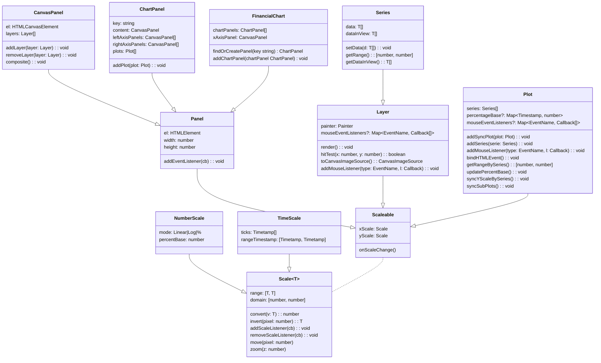
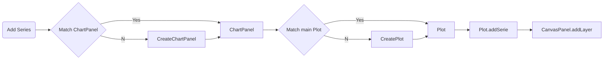
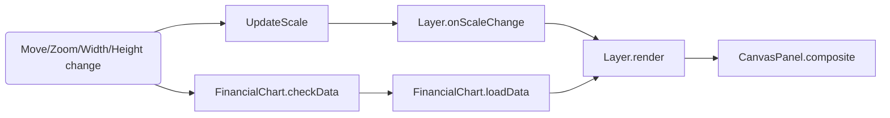
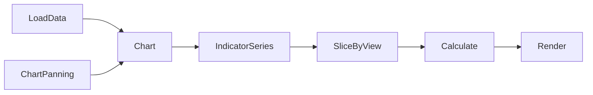
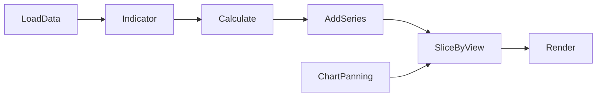
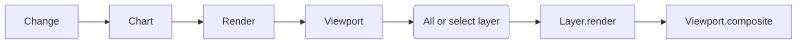
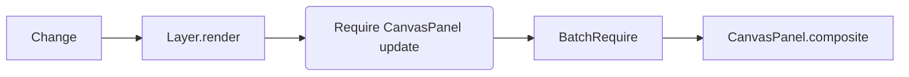
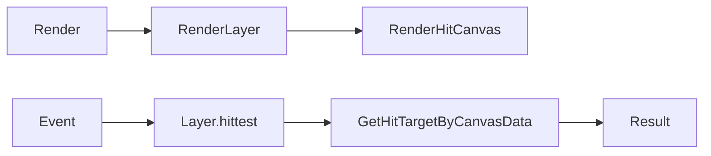
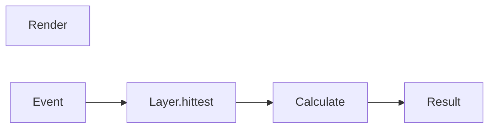

# React Chart(canvas)
[DEMO](https://strongball.github.io/react-analyze-chart/)  

## Class

### ClassDiagram

### Description

| Name           | Description                                                                                                                                |
| -------------- | ------------------------------------------------------------------------------------------------------------------------------------------ |
| Scale          | Manage data and canvas domain. Convert data to canvas coordinates.                                                                         |
| Panel          | Having scale and html element.                                                                                                             |
| CanvasPanel    | Having a real canvas element. All layer render on this one.                                                                                |
| FinancialChart | Having multiple ChartPanels. The root and entry point of all panel.                                                                        |
| ChartPanel     | Basic chart element. Having multiple CanvasPanels. One for chart content and several y-axis panels                                         |
| Plot           | Virtual class. To support different YScale in one ChartPanel(CanvasPanel)                                                                  |
| Layer          | The minimal unit to draw on canvas.                                                                                                        |
| Series         | Extends layer. Received data and draw items on canvas.                                                                                     |
| Painter        | Core drawing tool. Providing basic drawing method to help layer draw item on canvas. Can be implemented in different tech(canvas2D, WebGL) |

## Feature

| Name                     | Description                                                   |
| ------------------------ | ------------------------------------------------------------- |
| Different YAxis(scale)   | Linear, log, percentage                                       |
| Multiple YAxis           | Can show different YAxis for different scale                  |
| Different series by data | Each series can load different data according to requirements |

## Flow

### Add series

### Update layer

## Different part

### Data

#### Now

Should be recalculated every time when view changed.

#### New

Only data changes need to be recalculated.

### Render

#### Now

Every chagne always rerender all chart. While there is a way to do parial rerender, it's hard to use. Current code always uses `render(*)` to trigger rerender.

#### New

Layer will update itself when something changed.

### Hit

#### Now

We need draw two shape on different canvas at each render. One for display and another is for hittest. HitCanvas can be treated as a 3D array([W, H, C]). The color of each position is the mark of item. If the mouse position has color, it means it touch something.

#### Plan

Calculate mouse position and graphics by algorithm. Reduce render time but may cause more loading during hittest.

