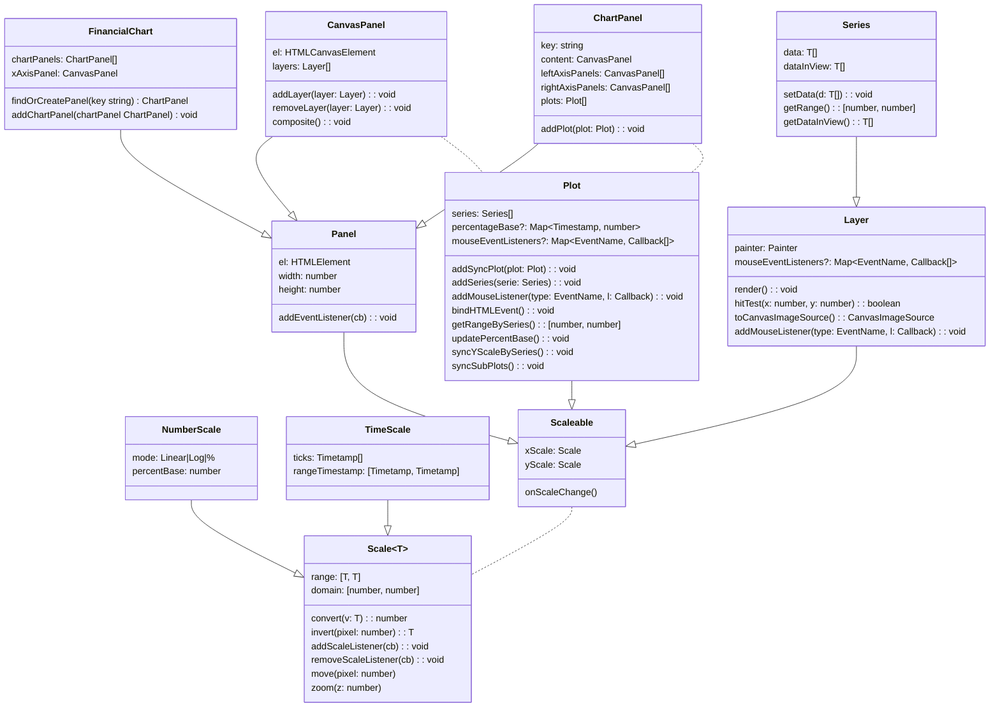

```mermaid
classDiagram
  class Scale~T~ {
    range: [T, T]
    domain: [number, number]

    convert(v: T): number
    invert(pixel: number): T
    addScaleListener(cb): void
    removeScaleListener(cb): void

    move(pixel: number)
    zoom(z: number)
  }

  NumberScale --|> Scale
  class NumberScale {
    mode: Linear|Log|%
    percentBase: number
  }

  TimeScale --|> Scale
  class TimeScale {
    ticks: Timetamp[]
    rangeTimestamp: [Timetamp, Timetamp]
  }


  Scaleable .. Scale
  class Scaleable {
    xScale: Scale
    yScale: Scale

    onScaleChange()
  }

  Panel  --|> Scaleable
  Layer --|>  Scaleable
  Plot --|> Scaleable

  class Panel {
    el: HTMLElement

    width: number
    height: number

    addEventListener(cb): void
  }

  class Layer {
    painter: Painter
       mouseEventListeners?: Map~EventName, Callback[]~
    render(): void
    hitTest(x: number, y: number): boolean
    toCanvasImageSource(): CanvasImageSource
        addMouseListener(type: EventName, l: Callback): void
  }

  Series --|> Layer
  class Series~T~{
    data: T[]
    dataInView: T[]
    setData(d: T[]): void
    getRange(): [number, number]
    getDataInView(): T[]
  }

  CanvasPanel --|>  Panel
  class CanvasPanel {
    el: HTMLCanvasElement
    layers: Layer[]

    addLayer(layer: Layer): void
    removeLayer(layer: Layer): void
    composite(): void
  }

  ChartPanel --|> Panel
  class ChartPanel {
    key: string
    content: CanvasPanel
    leftAxisPanels: CanvasPanel[]
    rightAxisPanels: CanvasPanel[]

    plots: Plot[]
    addPlot(plot: Plot): void
  }

  ChartPanel .. Plot
  CanvasPanel .. Plot
  class Plot {
    series: Series[]
    percentageBase?: Map~Timestamp, number~
    mouseEventListeners?: Map~EventName, Callback[]~

    addSyncPlot(plot: Plot): void
    addSeries(serie: Series): void
    addMouseListener(type: EventName, l: Callback): void
    bindHTMLEvent(): void
    getRangeBySeries(): [number, number]
    updatePercentBase(): void
    syncYScaleBySeries(): void
    syncSubPlots(): void
  }

  FinancialChart --|> Panel
  class FinancialChart {
    chartPanels: ChartPanel[]
    xAxisPanel: CanvasPanel
    findOrCreatePanel(key string) ChartPanel
    addChartPanel(chartPanel ChartPanel) void
  }
```
